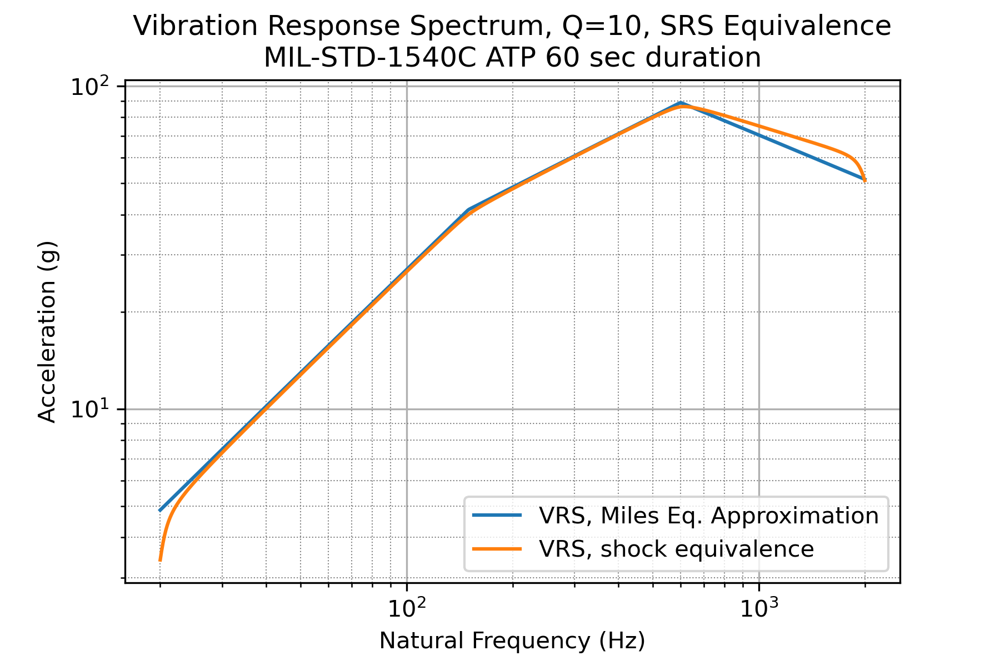

# Loads And Dynamics
## Repository of MATLAB and Python Code Related to Loads and Dynamics

### Purpose
This code was written as I worked through Tom Irvine's tutorials from [vibrationdata.com](http://www.vibrationdata.com). I started this repository with MATLAB, but I will primarily be adding to the python directory from now on (to sharpen my python skills).

### SDOF reponse to base input
The code can be used to calculate/plot the response of an SDOF system to a base input. An example is shown below (this plot was created using the MATLAB code):

You can also calculate/plot the vibration response spectrum for a base vibration input as shown below (plot created in python):

The "equivalent" shock response spectrum induced by a stationary random vibration can be calulated given the vibration spectral density and a test duration. The equivalent shock response spectrum for the stationary vibration spectrum is assumed to be equal to the $n\sigma$ vibration response spectrum, where $n = (2\ln{(f_nT)})^{1/2}$ where $f_n$ is the natural frequency and $T$ is the test duration. $n$ is commonly called the peaking factor or peak factor. An SDOF oscillator with natural frequency $f_n$ will have a narrowband response to a vibration base excitation. The gRMS of this response is the $1\sigma$ value of the time history. To estimate the peak time domain response of the SDOF oscillator to a stationary random vibration, the grms of the response is multiplied by the peaking factor, $n$. The plot below shows the equivalent SRS for MIL-STD-1540C ATP with test duration of 60 seconds. The shock equivalent VRS can also be estimated using the Miles Equation, as described in NASA SMC-S-016, Appendix B.1.6. This estimate is also shown in the plot below.

