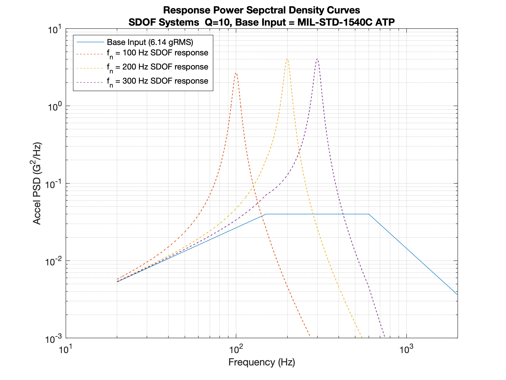
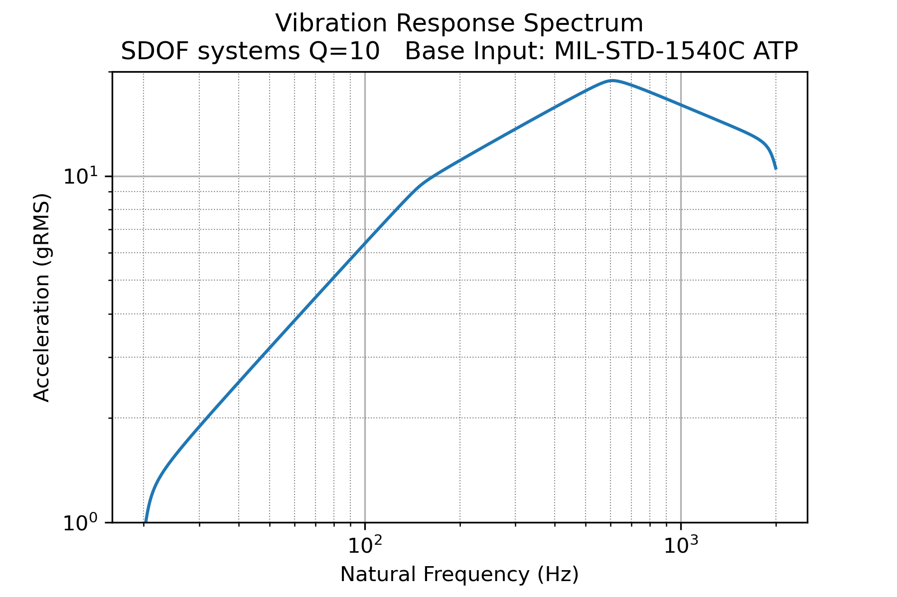

# Loads And Dynamics
## Repository of MATLAB and Python Code Related to Loads and Dynamics

### Purpose
This code was written as I worked through Tom Irvine's tutorials from [vibrationdata.com](http://www.vibrationdata.com). I started this repository with MATLAB, but I will primarily be adding to the python directory from now on (to sharpen my python skills).

### SDOF reponse to base input
The code can be used to calculate/plot the response of an SDOF system to a base input. An example is shown below (this plot was created using the MATLAB code):

You can also calculate/plot the vibration response spectrum for a base vibration input as shown below (plot created in python):

